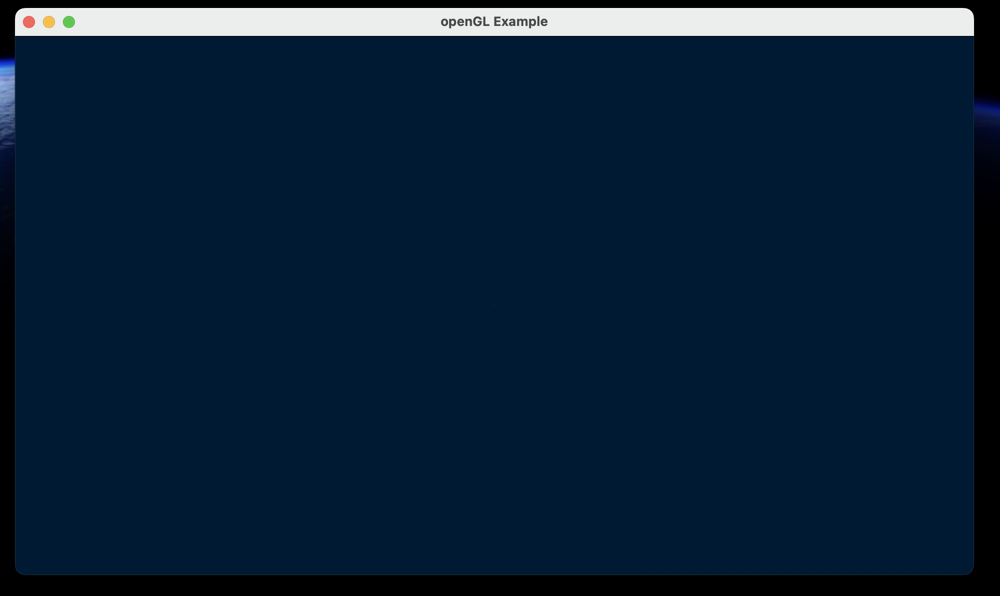
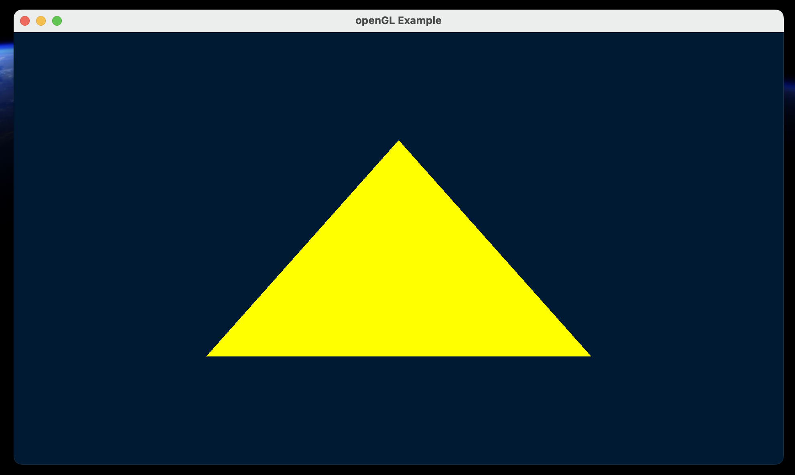
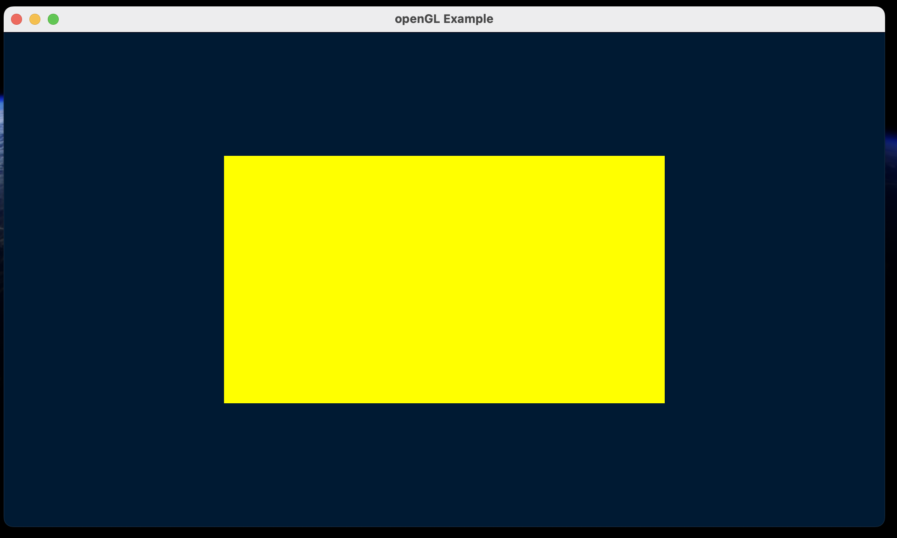
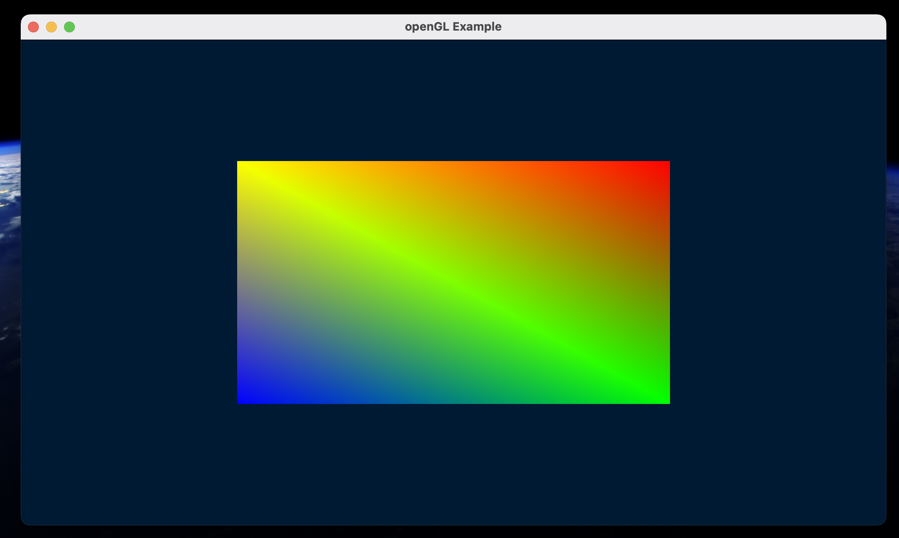
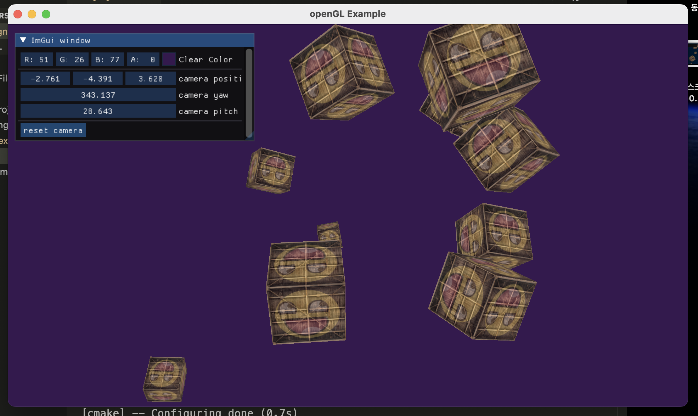
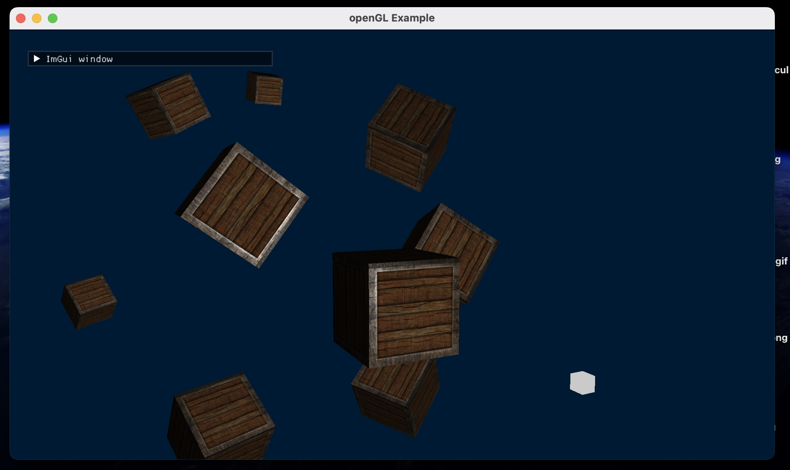

# Learning openGL

<details>
  <summary># [W01] cmake_project_example</summary>

- I learned how to set up OpenGL on an M1 MacBook.
- CMake will be used for configuring and building projects.
- I will create a `CMakeLists.txt` file and configure and build the project using the command palette in VSCode.
- OpenGL will be compiled with Xcode (Apple supports OpenGL up to version 4.1).

## What should I learn this week?
In this chapter, I will set up my OpenGL environment on an M1 Mac running macOS.

I will use VSCode to progress in coding for graphics programming.

## Setup
Some extensions are needed in VSCode.

1. C/C++ extension.
2. ~~C/C++ Intellisense~~: Deprecated. It was merged into the C/C++ extension.
3. CMake.
4. CMake Tools.

## Compilation
On macOS, OpenGL has been officially deprecated. So, I will use OpenGL 3.3 to study computer graphics.
(I heard OpenGL 4.6 was released, but Apple supports only up to 4.1.)

Additionally, I need **Xcode** to compile OpenGL code.

## CMake
It surprised me! At 42 Seoul, I had to manually type all the `Makefile` commands to compile the source code and generate the executable file.
With CMake, it automatically creates the build directory and `Makefile` with just one action.

### CMakeLists.txt
This is a recipe to create the build directory. We can set the following points:

- Define build targets (e.g., `add_executable`, `add_library`).
- Set compiler options and link options.
- Find external libraries (`find_package`).
- Set installation rules.

In this chapter, I created a `CMakeLists.txt` like the one below:

```cmake
# Set minimum version of CMake
cmake_minimum_required(VERSION 3.14)

# Set variable PROJECT_NAME as cmake_project_example and specify C++ version
set(PROJECT_NAME cmake_project_example)
set(CMAKE_CXX_STANDARD 17)

# Define the project. The project() command sets the project name and language version.
project(${PROJECT_NAME})

# Add executable file for ${PROJECT_NAME} using src/main.cpp
add_executable(${PROJECT_NAME} src/main.cpp)
```

### Configuration & Build
In this class, I use the command palette for "CMake: Configure" and "CMake: Build".

1. **Configuration**  
   In this step, the `CMakeLists.txt` is processed, creating the build system (like a `Makefile`), and setting up the environment for the compiler, platform, etc.

2. **Build**  
   The sources are compiled, and object files are linked. All requested targets (libraries, executables, etc.) are built.

In our source code, `main.cpp`, we print "Hello, World!" to stdout. When we execute the built executable, we can see "Hello, World!" printed in the console.


</details>

<details>
<summary> # [W02] </summary>

## Including External Library Using CMake

### Add GLFW Dependency
- OpenGL is just an API for graphics.
- It doesn't have features like creating a window, creating and connecting a surface, or connecting a keyboard and mouse to the window.

For these utilities, we need the **GLFW** library. It will be included using CMake, making it easy to connect to our project.

### In the CMake File to Add External Library Dependency

<details><summary> Dependency.cmake File </summary>

```cmake
# include below adds an external project.
# Here, include allows us to use the ExternalProject_Add feature.
include(ExternalProject)

# Set variables for the dependency.
set(DEP_INSTALL_DIR ${PROJECT_BINARY_DIR}/install)
set(DEP_INCLUDE_DIR ${DEP_INSTALL_DIR}/include)
set(DEP_LIB_DIR ${DEP_INSTALL_DIR}/lib)

# ExternalProject_Add function creates a connection between our project and an external git project. 
# The external project will be automatically handled by CMake, and we also configure the CMake options for the external project.

ExternalProject_Add(
    dep_glfw
    GIT_REPOSITORY "https://github.com/glfw/glfw.git"
    GIT_TAG "3.3.3"
    GIT_SHALLOW 1
    UPDATE_COMMAND ""
    PATCH_COMMAND ""
    TEST_COMMAND ""
    CMAKE_ARGS
        -DCMAKE_INSTALL_PREFIX=${DEP_INSTALL_DIR}
        -DGLFW_BUILD_EXAMPLES=OFF 
        -DGLFW_BUILD_TESTS=OFF
        -DGLFW_BUILD_DOCS=OFF # These options can be found in glfw's CMakeLists.txt. 
        # Using the -D flag, we modify the options.
)

# Setting DEP_@@@@ variables as ${DEP_@@@@} + ###.
# Adding the dependency list and library file list.
set(DEP_LIST ${DEP_LIST} dep_glfw)
set(DEP_LIBS ${DEP_LIBS} glfw3)
```

</details>

If you want to include external libraries, it is better to separate the CMake file into *CMakeLists.txt* and *Dependency.cmake*. This makes managing external and internal libraries easier.

The above code is typed in *dependency.cmake*.

If the code is separated into two files, you need to include the external dependency in your *CMakeLists.txt*.

```cmake
# In CMakeLists.txt, include dependency.cmake
include(Dependency.cmake)

# Set the directories containing headers and libraries.
# In order:
# - location of header files → sets the headers for the compiler.
# - location of library files → specifies the location where the linker can find the necessary library files.
# - sets the libraries → defines the libraries that the linker will reference during compilation.
target_include_directories(${PROJECT_NAME} PUBLIC ${DEP_INCLUDE_DIR})
target_link_directories(${PROJECT_NAME} PUBLIC ${DEP_LIB_DIR})
target_link_libraries(${PROJECT_NAME} PUBLIC ${DEP_LIBS})
```

In *CMakeLists.txt*, we can set the information about the window.

```cmake
# GLFW window setting information
set(WINDOW_NAME "Hello, OpenGL!")
set(WINDOW_WIDTH 960)
set(WINDOW_HEIGHT 540)

# It's the same as "#define WINDOW_NAME "HELLO OPENGL"
# It replaces with a define macro.
target_compile_definitions(${PROJECT_NAME} PUBLIC
    WINDOW_NAME="${WINDOW_NAME}"
    WINDOW_WIDTH=${WINDOW_WIDTH}
    WINDOW_HEIGHT=${WINDOW_HEIGHT}
)

# Dependency files (${DEP_LIST}) must be built before my project.
add_dependencies(${PROJECT_NAME} ${DEP_LIST})
```

As I mentioned, I use macOS. On macOS, you need to explicitly link the required frameworks.

In *dependency.cmake*:

```cmake
if (APPLE)
    find_library(COCOA_FRAMEWORK Cocoa)
    find_library(IOKIT_FRAMEWORK IOKit)
    find_library(COREFOUNDATION_FRAMEWORK CoreFoundation)

    target_link_libraries(${PROJECT_NAME} PUBLIC
        ${COCOA_FRAMEWORK}
        ${IOKIT_FRAMEWORK}
        ${COREFOUNDATION_FRAMEWORK}
        ${OPENGL_FRAMEWORK}
    )
endif()
```

1. **Cocoa**:
   - A framework for constructing user interfaces.

2. **IOKit**:
   - A framework for handling hardware-related tasks, such as interacting with external devices and monitoring hardware status (displays, keyboards, mice, etc.).

3. **CoreFoundation**:
   - A framework for low-level data structures and utilities.
   - Provides tools like basic data types, strings, dates, and collections (arrays, dictionaries, etc.).
   - Helps interact between other macOS frameworks by providing various data types and algorithms.


## Adding Glad Dependency

You include it in the same way as GLFW, but you need to include the Glad header before GLFW. This is because GLFW relies on Glad for loading OpenGL function pointers.

## Booting the Window

1. **glfwInit()**
   - Initializes the GLFW library.
   - This is the first step in using GLFW.

2. **glfwWindowHint()**
   - This function provides information about the window settings.
   - It configures the window by using the hints we pass, such as the OpenGL version, profile, forward compatibility, etc.

3. **glfwCreateWindow()**
   - Creates the window we want with parameters like width, height, and window title.

4. **glfwMakeContextCurrent()**
   - Sets the specified window as the current context.

5. **gladLoadGLLoader()**
   - Loads the OpenGL functions for the current context using the given process address loader function.
   - After this call, OpenGL functions can be used.

6. **glfwWindowShouldClose()**
   - Returns a boolean indicating whether the window should close.

7. **glfwPollEvents()**
   - Checks for events such as keyboard or mouse input.

8. **glfwTerminate()**
   - Cleans up and terminates the GLFW library.

In this flow, we can add functions for graphics:
- **glClearColor()** and **glClear()**: Set the background color and clear the window with that color.
- **glfwSwapBuffers()**: Swaps the window's buffers to display the rendered image smoothly.

- **glfwSetFramebufferSizeCallback()** and **glfwSetKeyCallback()**: Set callback functions for window resize or key press events.


- **glViewport(0, 0, width, height)**
   - Sets the viewport, which determines the area of the window where rendering happens.
   - The first two parameters (0, 0) refer to the lower-left corner of the window, and the other two specify the width and height of the viewport.

   If the window size changes, you must call `glViewport()` again to reset the viewport size.


then, we can get this window.


</details>

<details><summary> # [W03] </summary>

# Graphics Pipeline

- **Application**: The application provides the vertex locations and colors that we want to draw. In 3D graphics, we generally draw pictures using triangles. In this stage, OpenGL functions are called to handle drawing. After this step, the GPU will be used.

- **Geometry**: This stage processes vertex data and defines vertex positions. It determines how the triangle's location is perceived from a certain camera angle by transforming the geometry according to the camera's viewpoint.

- **Rasterization**: Converts transformed vertices into fragments (potential pixels), turning geometric information into pixels.

- **Pixel Processing**: Processes individual pixels and defines their color, often based on lighting, textures, or other effects.

## Programmable Shader

GLSL (OpenGL Shading Language) is used for GPU programming and is available from the OpenGL 3.3 core profile onward. We need to write the shader code directly.

- **Vertex Shader**: Calculates information for each vertex, such as position, normals, and other per-vertex attributes.
- **Fragment Shader**: Calculates information for each pixel, mainly determining its final color.

## OpenGL Shader

We write the code for vertex and fragment shaders and then build the program. Additionally, there is a way to build shaders before loading using SPIR-V (not covered in this class).

## Shader Code Loading

- Read the shader code from a file.
- Create a shader object and assign the shader code to it.
- Compile the shader.
- If compilation fails, report the error.

## In `src/common.h`

This header file contains commonly used functions.

### `std::optional<>`

```cpp
std::optional<std::string> LoadTextFile(const std::string &filename);
```

`std::optional<>` is a feature introduced in C++17. It provides a way to handle variables that might not have a value. You can check whether the variable has a value using the `has_value()` function.

## Shader Class Design

There is an OpenGL shader object. When an instance is created, it takes a filename for loading. If instance creation fails, we need to free the memory. This is managed using C++11 smart pointers.

### Smart Pointers

Smart pointers manage memory automatically (RAII). Explicit deletion is not needed.

- **`std::unique_ptr<>`**: Manages a memory block exclusively. When the object goes out of scope, it is automatically deleted by the destructor. There is only one owner of the memory, and ownership cannot be copied. Use move semantics to transfer ownership.

- **`std::shared_ptr<>`**: Shares ownership of the memory among multiple pointers. The memory is deleted when the last `shared_ptr` owning it is destroyed.

- **`std::weak_ptr<>`**: Provides access to an object managed by a `shared_ptr` without increasing its reference count, preventing cyclic references.

1. The constructor is private to prevent direct instantiation. Only `CreateFromFile()` can create an instance. Use `CreateFromFile` to create a shader object.

2. No `set()` function is provided. Shader data is managed within the shader object and is protected.

```cpp
ShaderUPtr Shader::CreateFromFile(const std::string& filename, GLenum shaderType)
{
    auto shader = ShaderUPtr(new Shader());
    if (!shader->LoadFile(filename, shaderType))
        return nullptr;
    return std::move(shader);
}
```

In the above code, we allocate memory for the shader using a smart pointer (`ShaderUPtr`, which is likely a type alias for `std::unique_ptr<Shader>`). Then, we load the shader file. If loading fails, we return `nullptr`, and the allocated memory is automatically cleaned up when the `unique_ptr` goes out of scope. Otherwise, we return the shader by using `std::move` to transfer ownership.

```cpp
bool Shader::LoadFile(const std::string &filename, GLenum shaderType)
{
    auto result = LoadTextFile(filename);
    if (!result.has_value()) // Checks if the optional has a value.
        return false;

    auto &code = result.value();
    const char *codePtr = code.c_str();
    int32_t codeLength = static_cast<int32_t>(code.length());

    // Create and compile shader
    m_shader = glCreateShader(shaderType);
    glShaderSource(m_shader, 1, &codePtr, &codeLength);
    glCompileShader(m_shader);

    // Check for compile errors
    int success = 0;
    glGetShaderiv(m_shader, GL_COMPILE_STATUS, &success);
    if (!success)
    {
        char infoLog[1024];
        glGetShaderInfoLog(m_shader, 1024, nullptr, infoLog);
        SPDLOG_ERROR("Failed to compile shader: \"{}\"", filename);
        SPDLOG_ERROR("Reason: {}", infoLog);
        return false;
    }
    return true;
}
```

`Shader::LoadFile` is used to load the shader file. If loading the shader file using the `LoadTextFile` function fails, it returns `false`.

After `LoadTextFile` is used, the shader source code is provided to OpenGL functions.

We then compile the shader code written in GLSL for use in our program. If the compilation is successful, it returns `true`. Otherwise, it returns an error log and `false`.

In this function, we create a shader object and provide it with the shader source code.

- **`glCreateShader`**: Creates an OpenGL shader object and returns an integer ID for the shader.
- **`glShaderSource`**: Sets the GLSL source code in the OpenGL shader object.
- **`glCompileShader`**: Compiles the shader source code.
- **`glGetShaderiv`**: Retrieves information about the shader, such as its compile status.
- **`glGetShaderInfoLog`**: Retrieves the compilation error log for the shader.
- **`glDeleteShader`**: Deletes the shader object.

## Program Class Design

- We will make a pipeline program connected with a vertex shader and a fragment shader for rendering.
- Enter the two shader files into the program and link them.
- If linking succeeds, create an OpenGL program object; otherwise, free the memory.

In OpenGL, a **program object** is like a container to manage multiple shader files. Shader files should be linked to the program. Then we can operate just one program that controls many shaders. The GPU can execute this program using the `glUseProgram` function.

### OpenGL Program Functions

1. **`glCreateProgram()`**  
   - Creates a new program object and returns the program ID (an integer value).
   - Example: `GLuint programID = glCreateProgram();`

2. **`glAttachShader(GLuint program, GLuint shader)`**  
   - Attaches the shader to a certain program. The program must have shaders attached before linking. In this case, 'attach' means pointing to the shader object's address so that the program can access it. At this moment, it doesn't know whether the shader has been compiled correctly.
   - Example: `glAttachShader(programID, vertexShaderID);`

3. **`glLinkProgram(GLuint program)`**  
   - Links the attached shaders to create the final executable shader program. If the shaders are compiled and linked correctly, this function succeeds.
   - It checks whether the attached shaders have any problems compiling or interacting with other shaders.
   - If this function succeeds, the GPU can perform rendering.
   - Example: `glLinkProgram(programID);`

4. **`glUseProgram(GLuint program)`**  
   - Uses this program for the current OpenGL context. By using this program, rendering will be done according to the shaders linked within.
   - Example: `glUseProgram(programID);`

5. **`glGetProgramiv(GLuint program, GLenum pname, GLint *params)`**  
   - Gets the program information and status, e.g., linking status.
   - Example: `glGetProgramiv(programID, GL_LINK_STATUS, &status);`

6. **`glGetProgramInfoLog(GLuint program, GLsizei maxLength, GLsizei *length, GLchar *infoLog)`**  
   - Retrieves the program information log (compilation or linking errors, warnings).
   - Example: `glGetProgramInfoLog(programID, 512, NULL, infoLog);`

7. **`glDetachShader(GLuint program, GLuint shader)`**  
   - Detaches the shader from the program. The shader and program are not deleted—just detached from each other.
   - Example: `glDetachShader(programID, vertexShaderID);`

8. **`glDeleteProgram(GLuint program)`**  
   - Deletes the program object to free the memory.
   - Example: `glDeleteProgram(programID);`

9. **`glValidateProgram(GLuint program)`**  
   - Checks whether the program is valid in the current context. This function is useful for finding errors or debugging.
   - Example: `glValidateProgram(programID);`

10. **`glIsProgram(GLuint program)`**  
    - Checks whether the program is a valid object.
    - Example: `if (glIsProgram(programID)) { /* Program is valid */ }`

Shader instances can be used by another program instance. So, they are designed using `ShaderPtr` formed of `shared_ptr`. A `unique_ptr` has only one owner, but a `shared_ptr` can have multiple owners.

If the pointer variable's data type is `shared_ptr`, a `unique_ptr` can be moved into a `shared_ptr` to share ownership.

## Refactoring by Context Class

**Refactoring** means improving the code to make it easier to understand and to have a clear structure.

Make it a habit to write code that works correctly first, then refactor to improve its structure. If the code gets bigger, it might be hard to reuse the code without proper structuring.

### Context Class Design

- Initialize GLFW / OpenGL Context / GLAD.
- Create objects to draw a picture (shader, program).
- Render.
- Free OpenGL objects to release memory.
- Terminate GLFW / program.

**Goals of the context class**: Manage the OpenGL objects and rendering code.

### VAO, VBO, EBO

- **Vertex Array Object (VAO)**: Like a container for VBO and EBO buffer statuses and attribute configurations.
- **Vertex Buffer Object (VBO)**: A buffer containing vertex information like position, color, etc., which is delivered to the GPU.
- **Element Buffer Object (EBO)**: A buffer delivering information about vertex indices.

1. Create VAO -> Bind it.
2. Create VBO / EBO -> Bind them -> Use `glBufferData` to deliver data to the GPU.
3. Let the GPU know about the delivered buffers. The `glVertexAttribPointer` function gives the GPU information about the buffer, and `glEnableVertexAttribArray` enables rendering with the delivered attributes.

After use, unbind the VAO to allow for rendering with other VAOs.

```cpp
GLuint vao;
glGenVertexArrays(1, &vao);
glBindVertexArray(vao);

// Set up VBO
GLuint vbo;
glGenBuffers(1, &vbo);
glBindBuffer(GL_ARRAY_BUFFER, vbo);
glBufferData(GL_ARRAY_BUFFER, size, data, GL_STATIC_DRAW);

// Set up EBO
GLuint ebo;
glGenBuffers(1, &ebo);
glBindBuffer(GL_ELEMENT_ARRAY_BUFFER, ebo);
glBufferData(GL_ELEMENT_ARRAY_BUFFER, size, data, GL_STATIC_DRAW);

// Set up vertex attributes
glVertexAttribPointer(0, 3, GL_FLOAT, GL_FALSE, stride, (void*)offset);
glEnableVertexAttribArray(0);

// Unbind VAO (optional, for good practice)
glBindVertexArray(0);
```



## Vertex Input

Several kinds of information are needed for vertices: data transferring from CPU to GPU, vertex coordinates, etc.

1. **Prepare the vertex data**: In the lecture, this includes vertices and indices arrays.

2. **Vertex Buffer Object (VBO)**:
   - The `glGenBuffers` function creates a VBO. A VBO is a buffer object that can contain vertex data. Various pieces of information about vertices can be stored in a VBO. This data is stored in memory that the GPU can access (position, normal, tangent, color, texture coordinates, etc.).
   - This function allocates usable GPU memory and returns an integer value referring to the buffer ID. If you want to use this buffer in the current context, bind the buffer to the context using `glBindBuffer`.

3. **Storing the data into the Vertex Buffer Object**:
   - Vertex data in CPU memory should be delivered to the GPU (using the `glBufferData` function).

4. **Vertex Array Object (VAO) - Descriptor Object**:
   - The VAO stores the vertex data structure, like each vertex's byte size, how many bytes between vertices (stride), data type, etc. It holds the information about the buffer.
   - Then, enable the attributes for rendering by using `glVertexAttribPointer` and `glEnableVertexAttribArray`.
   - Images are drawn using the Program, VBO, and VAO.



If you want to draw a square, let's draw two triangles. Using a VBO alone will require storing 6 vertices, but this is inefficient because we only need 4 unique vertices.

By using an EBO, we can provide information on how the vertices will be used and reused, reducing redundancy.

The vertex indices in the EBO will be used to draw in order, allowing us to reuse vertices.



The rendering will draw the picture using the context bound with VAO, VBO, and EBO.

The `glDrawElements(GL_TRIANGLES, 6, GL_UNSIGNED_INT, 0)` function will draw the basic vertex shapes.

- **Primitive Type**: Specifies the type of primitives to render (e.g., `GL_TRIANGLES`).
- **Count**: The number of elements to render, which is the number of indices in the EBO.
- **Type**: Specifies the type of the values in the EBO (e.g., `GL_UNSIGNED_INT`).
- **Indices**: Specifies an offset in a buffer or a pointer to the indices (here, 0 since we're starting from the beginning).

## Buffer Class Design

VBO and EBO share the OpenGL functions (`glGenBuffers`, `glBindBuffer`, `glBufferData`, etc.). Therefore, we can create a class to manage buffers more efficiently.

## `VertexLayout` Class

The VAO manages the vertex buffer information. We can encapsulate this functionality in a `VertexLayout` class to handle VAO configurations and attribute setups.

</details>

<details><summary> # [W04] GLSL </summary>

## GLSL (OpenGL Shading Language)

A shader is a small program that runs on the GPU to perform rendering calculations. Rendering operations are executed in parallel across vertices and pixels.

GLSL is the shader language used in OpenGL for coding shaders.

Other shader languages include:

- **HLSL** (High-Level Shading Language) used in DirectX
- **Metal** used in Apple's Metal API
- **Cg** (C for Graphics) by NVIDIA, used in Unity3D

## Basic GLSL Structure

```glsl
#version version_number // Predefined macro

in type in_variable_name;

out type out_variable_name;

uniform type uniform_name;

void main() {
    // Process input(s) and perform graphics operations...
    // Output processed data to output variable
    out_variable_name = processed_data;
}
```

**Type Qualifiers**:

- **`in`**: Input to the shader program.
- **`out`**: Output from the shader program.
- **`uniform`**: Global variables that remain constant for all processed vertices or fragments during a single rendering call.

Shader code also has the `main()` function as an entry point. The shader's output should be stored in an `out` variable.

## GLSL Data Types

- **Basic Types**: `int`, `float`, `double`, `uint`, `bool`
- **Vector Types**:
  - `vecX` (float vectors), `bvecX` (bool vectors), `ivecX` (int vectors), `uvecX` (uint vectors), `dvecX` (double vectors)
  - `X` can be 2, 3, or 4, indicating the number of components.
- **Matrix Types**:
  - `matX`, `bmatX`, `imatX`, `umatX`, `dmatX`
  - `X` can be 2, 3, or 4, representing the dimensions of the square matrix.

### Vectors

- **Accessing Vector Elements**:
  - Use `.x`, `.y`, `.z`, `.w` to access each component.
  - Swizzling allows you to reorder or replicate components (e.g., `vec4 v; vec3 v_xyz = v.xyz;`).
  - Swizzling can also be done using `.rgba` for colors or `.stpq` for texture coordinates.

**Examples of Swizzling**:

```glsl
vec2 someVec;
vec4 differentVec = someVec.xyxx;
vec3 anotherVec = differentVec.zyx;
vec4 otherVec = someVec.xxxx + anotherVec.yxzy;
```

**Initializing Vectors**:

```glsl
vec2 vect = vec2(0.5, 0.7); // vec2 constructor
vec4 result = vec4(vect, 0.0, 0.0); // Using another vector to initialize
vec4 otherResult = vec4(result.xyz, 1.0); // Vector swizzling + another component
```

When using other vectors in vector initialization, the basic data types should be the same.

## `in` / `out`

Shaders use `in` and `out` qualifiers to define inputs and outputs.

Every shader should declare the correct `in`/`out` variables to interface with other shader stages.

### Vertex Shader

- Inputs are the vertex attributes provided by the application.
- You can set the attribute index using the following syntax:

  ```glsl
  layout(location = n) in type variable_name;
  ```

- **Important**: The vertex shader must set the output position `gl_Position`. If not, the vertex shader will not compile.

- **Rasterization**: The output of the vertex shader is used to interpolate primitives and calculate data for each pixel.
  
### Fragment Shader

- The interpolated data from the rasterization stage is provided as inputs to the fragment shader.

- For example, if the vertex shader outputs:

  ```glsl
  out vec4 vertexColor;
  ```

  Then the fragment shader should have:

  ```glsl
  in vec4 vertexColor;
  ```

  This linkage is important for passing data between shader stages.

**Uniforms**: Global variables that can be accessed by all shader stages. They hold constant values during the rendering of a primitive and are shared among all shader invocations.

To set the value of a uniform variable:

1. Get the uniform location using `glGetUniformLocation`.
2. Bind the program using `glUseProgram`.
3. Set the uniform value using `glUniform*` functions.

## Vertex Attributes

There is a lot of vertex information:

- Position
- Normal
- Tangent
- Color
- Texture Coordinates
- etc.

Each of them is a vertex attribute.

At this point, we are creating a color attribute for each vertex to pass color data from the vertex shader to the fragment shader.




make the color attribution changed every render loops.


---

</details>


<details><summary> # [W05] Texture </summary>

---

# Texture

It is hard to draw some objects in a picture by just setting the vertices because it would require too many vertices. Not only vertex positions but also color and texture information are needed.

## Texture Mapping
Texture mapping involves applying an image to the surface of a model by associating it with vertices.

## Texture Coordinates
- The texture image position corresponds to the vertex area.
- Texture coordinates are normalized to the range [0, 1], with the bottom-left corner as the origin.

Texture coordinates are provided as vertex attributes to the vertex shader.

During rasterization, each pixel's texture coordinate value is calculated.

In the fragment shader, the color of the texture image is fetched according to the texture coordinate.

## Texture Wrapping
How to handle texture coordinates that fall outside the [0, 1] range:

- `GL_REPEAT`: Repeats the texture image.
- `GL_MIRRORED_REPEAT`: Repeats the texture image, but mirrors it with each repeat.
- `GL_CLAMP_TO_EDGE`: Clamps the texture coordinate to the edge of the texture.
- `GL_CLAMP_TO_BORDER`: Clamps the texture coordinate to a border color.

Texture coordinates do not have to be within [0, 1]; these settings determine how to handle values outside this range.

## Texture Filtering
If the texture image size does not match the screen size, you need to decide how to sample texture pixels:

- `GL_NEAREST`: Selects the nearest pixel to the texture coordinate. This can result in noticeable pixelation.
- `GL_LINEAR`: Interpolates the values of the four nearest pixels. This provides smoother transitions.

## Texture in OpenGL
1. Create and bind OpenGL texture objects.
2. Set texture wrapping and filtering options.
3. Copy the image data to GPU memory.
4. Send the texture you want to use to the shader program as a uniform.

# Example
## Image Loading
1. Include `stb_image.h`.
   - `stb_image.h` is a library for loading image formats such as JPG, PNG, TGA, etc. It is a single-file public domain library, making it easy to use.

## Image Class Design

## Texture Application
- Add texture coordinates to vertex attributes.
- Create shaders that read the texture and define the pixel values.

## OpenGL Texture API
- `glGenTextures()`: Creates OpenGL texture objects.
- `glBindTexture()`: Binds a texture object to the current texture target.
- `glTexParameteri()`: Sets texture filter and wrapping parameters.
- `glTexImage2D(target, level, internalFormat, width, height, border, format, type, data)`
  - Transfers texture data from CPU memory to GPU memory, specifying how the data should be used.
  - `target`: Specifies the texture target (e.g., `GL_TEXTURE_2D`).
  - `level`: Specifies the mipmap level. 0 is the base level, related to mipmaps.
  - `internalFormat`: Specifies the format used by the GPU.
  - `width / height / border`: Specifies the texture width, height, and border size.
  - `format`: Specifies the format of the pixel data.
  - `type`: Specifies the data type of the pixel data.
  - `data`: Pointer to the image data.

- Power-of-2 (POT) textures are most efficient for GPUs.
- NPOT (Non-Power-Of-Two) textures may be unsupported depending on GPU specifications.

# Texture Refactoring
Since image data is used only once, a smart pointer might be too heavy for just creating textures. We use a simple pointer for the image in our class.

## Checker Image Creation
- Create a checkerboard image programmatically instead of downloading it.

## Mipmap
When the checkerboard is scaled down, artifacts may appear.
- If the texture pixel area is larger than the screen pixel, it is fine.
- But if the screen pixel covers more than one texture pixel, artifacts can occur.

-> Mipmaps are used to avoid this issue.
Mipmaps involve creating and using smaller versions of the texture image. As the screen size gets smaller, the appropriate smaller mipmap level is used to prevent distortion.

## Multiple Textures
Blending multiple textures in the fragment shader.

### How to Provide Textures to the Shader Program
The maximum number of textures that can be used in a shader program is 32. There are 32 texture slots available.

1. `glActiveTexture(textureSlot)`: Choose and activate a texture slot.
2. `glBindTexture(textureType, textureId)`: Bind the texture object to the currently active texture slot.
3. `glGetUniformLocation()`: Get the uniform location in the shader.
4. `glUniform1i()`: Set the texture slot index to the `sampler2D` uniform.

## Changes in context.cpp
1. Vertices
   - We provide just 6 elements per vertex. However, in this case, we need to include vertex position, color, and texture coordinates.
   - Therefore, 8 elements per vertex are needed.

2. SetAttrib
   - Inform the GPU of the data format using `glVertexAttribPointer()` and `glEnableVertexAttribArray`.
   - Since we added texture coordinates, we need to specify this to the GPU.

3. Loading the Image
   - Use the `stb` function to load image data into the program.

4. Making Texture Objects
   - Generate, bind, and set texture information using `glGenTextures()`, `glBindTexture()`, and `glTexParameteri()`.

---

</details>

<details><summary> # [W06] Transformation </summary>

# C++ Matrix/Vector Calculations
- GLSL provides many functions for matrix and vector operations.
- C++, by default, does not offer matrix and vector calculation tools.
→ To solve this, we use libraries.

## C++ Matrix Libraries
### Eigen3
- A C++ library for linear algebra.
- It is widely used in various libraries, such as OpenCV.
- Eigen3 is particularly useful for complex linear algebra calculations.

### GLM
- OpenGL Mathematics (GLM) library.
- It supports 3D graphics-related calculations, including 4D vectors and matrices.
→ Add GLM to `Dependency.cmake`.

GLM consists solely of header files, so you only need to copy the headers to your build directory.

```cmake
ExternalProject_Add(
	dep_glm
	GIT_REPOSITORY "https://github.com/g-truc/glm"
	GIT_TAG "0.9.9.8"
	GIT_SHALLOW 1
	UPDATE_COMMAND ""
	PATCH_COMMAND ""
	CONFIGURE_COMMAND ""
	BUILD_COMMAND ""
	TEST_COMMAND ""
	INSTALL_COMMAND ${CMAKE_COMMAND} -E copy_directory
		${PROJECT_BINARY_DIR}/dep_glm-prefix/src/dep_glm/glm
		${DEP_INSTALL_DIR}/include/glm
	)
	
set(DEP_LIST ${DEP_LIST} dep_glm)
```

Then, include the GLM library in `common.h`.

## Vertex Transformation
- Vertices in the VBO are fixed.
- The transformation matrix is passed into the vertex shader as a uniform variable.
- The matrix multiplication is performed within the vertex shader.
- The uniform matrix is passed to the shader using `glGetUniformLocation` and `glUniformMatrix4fv`.

# Coordinate Systems
- Coordinate systems define the position of vertices.
- A linear transformation can be interpreted as a change from one coordinate system to another.

## Transforming Between Coordinate Spaces
In OpenGL, the space where objects are rendered is the normalized device coordinate space, ranging from [-1, 1].
This space is also known as the canonical space.

An object's position is initially described in local space. To render this object in canonical space, it must undergo several transformations:
1. Local Space → World Space
2. World Space → View Space
3. View Space → Canonical Space

### Transformation Matrices
- **Model Matrix**: Transforms from local space to world space.
- **View Matrix**: Transforms from world space to camera space.
- **Projection Matrix**: Transforms from camera space to canonical space.

In clip space (canonical space), objects that fall outside the [-1, 1] range will be clipped.

## Projection Methods
### 1. Orthographic Projection
An orthographic projection maintains parallel lines, meaning they remain parallel after the transformation.
- Parameters: left, right, bottom, top, near, far (total of 6)
- The projection matrix has -1 on the z-axis to account for the transition from right-handed to left-handed coordinates after clipping.

### 2. Perspective Projection
Parallel lines will converge at a single point in perspective projection. 
- The further an object is, the smaller it appears.
- Parameters: aspect ratio, field of view (FoV), near, far.

Using these matrices (MVP: Model-View-Projection), local space can be transformed into clip space.

## Creating a 3D Cube
In 3D, depth is a crucial factor in determining whether an object is in front of or behind another.
→ This requires the use of a depth buffer (also called a z-buffer).

### Depth Testing
Before updating pixel data, the depth of the current pixel is compared to the value stored in the z-buffer at the same location.
- If the current pixel's depth is greater (further away) than the z-buffer value, it will not be drawn.
- The z-buffer's initial value is 1, where 1 represents the furthest possible depth.

### OpenGL Commands for Depth Testing
- `glEnable(GL_DEPTH_TEST)`: Enables depth testing.
- `glDisable(GL_DEPTH_TEST)`: Disables depth testing.

The default condition for depth testing is `GL_LESS`, meaning the pixel with a lesser depth value (closer to the camera) will be drawn.

</details>

---

<details><summary> # [W07] </summary>

# Camera/View Space
- It is necessary to determine when and where to look at in 3D space.
- The view transformation is created from the parameters controlling the camera.

## Camera Parameters
- **Position**: Where the camera is located.
- **Target**: The point the camera is looking at.
- **Up Vector**: The direction that defines "up" for the camera.

The camera's matrix is the inverse of the transformation matrix that converts from local space to world space.

```c++
	float x = sinf((float)glfwGetTime() * glm::pi<float>() * 2.0f) * 3.0f;
	auto cameraPos = glm::vec3(x, 0.0f, 3.0f);
	auto cameraTarget = glm::vec3(0.0f, 0.0f, 0.0f);
	auto cameraUp = glm::vec3(0.0f, 1.0f, 0.0f);

	// Compute the camera basis vectors (Z, X, Y)
	// auto cameraZ = glm::normalize(cameraPos - cameraTarget);
	// auto cameraX = glm::normalize(glm::cross(cameraUp, cameraZ));
	// auto cameraY = glm::cross(cameraZ, cameraX);

	// Create the camera matrix
	// auto cameraMat = glm::mat4(
	// 	glm::vec4(cameraX, 0.0f),
	// 	glm::vec4(cameraY, 0.0f),
	// 	glm::vec4(cameraZ, 0.0f),
	// 	glm::vec4(cameraPos, 1.0f)
	// );

	// Obtain the view matrix by inverting the camera matrix
	// auto view = glm::inverse(cameraMat);
	auto view = glm::lookAt(cameraPos, cameraTarget, cameraUp);
```

The `glm::lookAt` function computes the view transformation matrix from `cameraPos`, `cameraTarget` (also called `cameraFront`), and `cameraUp`.
If we calculate the camera position every frame, we can get a different point of view dynamically.

# Interactive Camera
An interactive camera allows the user to control it using keyboard and mouse inputs.
We store the camera information within the context class.

```c++
glm::vec3 m_cameraPos { glm::vec3(0.0f, 0.0f, 3.0f) };
glm::vec3 m_cameraFront { glm::vec3(0.0f, 0.0f, -1.0f) }; // This represents the direction the camera is facing.
glm::vec3 m_cameraUp { glm::vec3(0.0f, 1.0f, 0.0f) };
```

`ProcessInput(GLFWwindow* window)`: This function calculates the camera position based on keyboard input.
Before rendering, the camera position should be updated by calling `ProcessInput`.

## Resizing the Screen
We need to adjust the aspect ratio of the perspective projection when the screen size changes.
Thus, the `context` class should have `Reshape()`, `m_width`, and `m_height` members.

`Reshape()` should be called whenever the window size is changed.
We can set up a callback in `main.cpp` using `glfwSetFramebufferSizeCallback` to handle resizing.

---

## Object Rotation
- **Euler Angles**: A common way to represent rotation.
-> Three angles are used: roll (z-axis), pitch (x-axis), and yaw (y-axis).

Usually, for camera rotation, roll (z-axis) is not used.
-> The roll is controlled by the up vector.
Yaw and pitch are typically used to express the direction the camera is facing.

We should include variables for these rotation angles in the `context` class.

### Member Variables:
- `m_cameraPitch`
- `m_cameraYaw`
- `m_cameraControl`

### Member Functions:
- `m_prevMousePos`
- `MouseMove`
- `MouseButton`

These functions update the member variables each frame.
We need to register GLFW callback functions for handling mouse and keyboard input in the system.

---

**Result:**
* 

# IMGUI

## GUI IN OPENGL

1. **Using a GUI Framework:**  
   Create a GUI interface and render it on an OpenGL surface using frameworks like Win32, MFC, Qt, Cocoa, or Android.

2. **Creating GUI Components Directly in OpenGL:**  
   Build GUI components inside the OpenGL window and handle events using libraries like ImGui.

---

[github.com/ocornut/imgui](https://github.com/ocornut/imgui)  
ImGui is an open-source library created by Omar Cornut. It is an Immediate-Mode GUI, which means UI elements are drawn directly using a graphics API every frame.

## Features of IMGUI

- **Immediate Mode GUI:**  
   UI components are recreated and rendered in each frame. This method is simple to use but can sometimes be mixed with other code that handles rendering of graphical objects.

- **Separation of Rendering Backend:**  
   ImGui can be used with various graphics APIs. If needed, you can write your own rendering backend for it.

- **Graphics Programming-Oriented Components:**  
   It includes components such as a vector editor and color picker, which are useful for graphics-related tasks.

- **Minimal Dependencies:**  
   ImGui is easy to build and integrate into projects, as it requires very few dependencies.

## Installing IMGUI

The ImGui repository does not come with a makefile or CMake configuration.  
Instead, you can manually download the source files and include them in your project.

When the application runs, ImGui's UI components will overlay the OpenGL screen. These components can be resized or moved using the mouse.

- **`ImGui_ImplGlfw_NewFrame()`**:  
   This function, called in the main loop, updates the screen size and mouse input by retrieving data from the `GLFWwindow`. 
   
   **Note**: You don’t need to explicitly connect callback functions like you normally would with GLFW.

## UI / Parameter Binding

You can bind UI elements to camera parameters, add a "Camera Reset" button, or a color picker to adjust the clear color.

Each ImGui function corresponds to a specific UI component and returns a boolean value. If the return value is `true`, it indicates the UI component has been changed.  
You can handle these events using `if` statements to add custom logic for when the UI changes.

## IMGUI Callback Integration

You can integrate ImGui into your existing callback functions or even replace certain callbacks with ImGui logic.  
For instance, ImGui's internal callbacks can be linked to your OpenGL callback functions to make everything work seamlessly.

## How to Learn ImGui?

ImGui doesn't have extensive official documentation. Most information about UI components is contained in `imgui.h`.  
For practical examples, you can refer to the `imgui_demo.cpp` file, which demonstrates the usage of various ImGui functions.





</details>

<details><summary> # [W08] </summary>

# Lighting
Lighting defines the color on the surface of objects.
It involves the **light source**, **material**, and **various complex physical phenomena**. For simplicity, we use the **Phong lighting model** to describe the illumination process.

## Illumination Model
Illumination models can be classified into two types based on how they handle reflected light.

- **Reflection light**: Light that is bounced off an object's surface.

1. **Local Illumination Model**: Does not account for reflected light from other objects or surfaces.
2. **Global Illumination Model**: Considers reflected light from other objects and surfaces, but at a higher computational cost.

## Phong’s Illumination Model
The Phong model calculates the surface color using three components:
- **Ambient** light
- **Diffuse** light
- **Specular** light

The final color is determined by combining these three lighting terms.

### Ambient Light
Ambient light is the general light that reaches all objects in the scene. It is unaffected by the object's normal vector or the light direction, meaning it is **constant** across the object's surface.

Ambient light is calculated as a combination of **light color** and **ambient strength**, which is then applied to the object’s color. This calculation happens in the fragment shader for each pixel.

### Diffuse Light
Diffuse light occurs when light hits an object’s surface and scatters in all directions. The intensity of the diffuse light depends on the angle between the light direction and the surface’s normal vector.

When the light direction is perpendicular to the object’s surface (the angle between them is 0 degrees), the diffuse light is at its strongest. This is calculated as the **dot product** of the light direction and the normal vector.

The calculation of diffuse light requires:
- **Light direction**
- **Normal vector**
- **Strength of the light source**

To calculate diffuse lighting in **world space**, the position and normal vectors must be transformed from local space to world space using the **model transformation matrix** in the vertex shader.

For accurate normal transformation, the normal vector should be multiplied by the **inverse transpose of the model matrix**, because normals are vectors, not points.

In the fragment shader, the normals may not be normalized, so they need to be **re-normalized**.

### Specular Light
Specular light is the reflection of light on an object’s surface, creating shiny highlights. Specular lighting is strongest when the **view direction** aligns with the **reflected light direction** (calculated as the dot product of the reflection vector and the view vector).

Key factors in specular lighting include:
- **Specular strength**: Controls the brightness of the specular highlight.
- **Shininess**: Controls the size or spread of the specular highlight.

The final color is computed by combining the **ambient**, **diffuse**, and **specular** terms in the fragment shader.

In the Phong model:
- `reflect(lightDir, normal)` calculates the reflection vector.
- The dot product of the **reflection vector** and **view direction** gives the intensity of the reflected light.
  
### Final Color Calculation
The final object color is a combination of **light color** and **material color**:
```cpp
finalColor = ambient + diffuse + specular;
```

The material and light properties can be organized into structures for cleaner code:
```cpp
struct Light { /* properties */ };
struct Material { /* properties */ };
```

### Lighting Maps
In the Phong model, the **ambient**, **diffuse**, and **specular** components can be replaced by **texture maps** for more complex lighting effects.

By using texture maps, the object’s material properties can vary across its surface. For example, the diffuse and specular terms can be extracted from **texture images**. The fragment shader samples the texture to obtain the color for lighting calculations.

### Summary
1. The Phong lighting model is a simple yet effective method for approximating real-world lighting in graphics.
2. **Ambient**, **diffuse**, and **specular** terms determine the final color of an object.
3. Texture maps can be used to enhance the realism by replacing material properties like diffuse and specular with more detailed texture data.



</details>