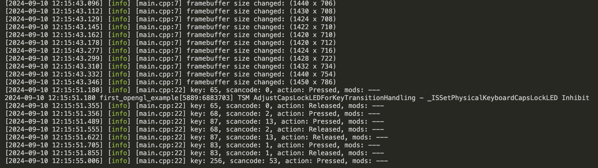

# Learning openGL

<details>
  <summary># [W01] cmake_project_example</summary>

- I learned how to set up OpenGL on an M1 MacBook.
- CMake will be used for configuring and building projects.
- I will create a `CMakeLists.txt` file and configure and build the project using the command palette in VSCode.
- OpenGL will be compiled with Xcode (Apple supports OpenGL up to version 4.1).

## What should I learn this week?
In this chapter, I will set up my OpenGL environment on an M1 Mac running macOS.

I will use VSCode to progress in coding for graphics programming.

## Setup
Some extensions are needed in VSCode.

1. C/C++ extension.
2. ~~C/C++ Intellisense~~: Deprecated. It was merged into the C/C++ extension.
3. CMake.
4. CMake Tools.

## Compilation
On macOS, OpenGL has been officially deprecated. So, I will use OpenGL 3.3 to study computer graphics.
(I heard OpenGL 4.6 was released, but Apple supports only up to 4.1.)

Additionally, I need **Xcode** to compile OpenGL code.

## CMake
It surprised me! At 42 Seoul, I had to manually type all the `Makefile` commands to compile the source code and generate the executable file.
With CMake, it automatically creates the build directory and `Makefile` with just one action.

### CMakeLists.txt
This is a recipe to create the build directory. We can set the following points:

- Define build targets (e.g., `add_executable`, `add_library`).
- Set compiler options and link options.
- Find external libraries (`find_package`).
- Set installation rules.

In this chapter, I created a `CMakeLists.txt` like the one below:

```cmake
# Set minimum version of CMake
cmake_minimum_required(VERSION 3.14)

# Set variable PROJECT_NAME as cmake_project_example and specify C++ version
set(PROJECT_NAME cmake_project_example)
set(CMAKE_CXX_STANDARD 17)

# Define the project. The project() command sets the project name and language version.
project(${PROJECT_NAME})

# Add executable file for ${PROJECT_NAME} using src/main.cpp
add_executable(${PROJECT_NAME} src/main.cpp)
```

### Configuration & Build
In this class, I use the command palette for "CMake: Configure" and "CMake: Build".

1. **Configuration**  
   In this step, the `CMakeLists.txt` is processed, creating the build system (like a `Makefile`), and setting up the environment for the compiler, platform, etc.

2. **Build**  
   The sources are compiled, and object files are linked. All requested targets (libraries, executables, etc.) are built.

In our source code, `main.cpp`, we print "Hello, World!" to stdout. When we execute the built executable, we can see "Hello, World!" printed in the console.


</details>

<details>
<summary> # [W02] </summary>

## Including External Library Using CMake

### Add GLFW Dependency
- OpenGL is just an API for graphics.
- It doesn't have features like creating a window, creating and connecting a surface, or connecting a keyboard and mouse to the window.

For these utilities, we need the **GLFW** library. It will be included using CMake, making it easy to connect to our project.

### In the CMake File to Add External Library Dependency

<details><summary> Dependency.cmake File </summary>

```cmake
# include below adds an external project.
# Here, include allows us to use the ExternalProject_Add feature.
include(ExternalProject)

# Set variables for the dependency.
set(DEP_INSTALL_DIR ${PROJECT_BINARY_DIR}/install)
set(DEP_INCLUDE_DIR ${DEP_INSTALL_DIR}/include)
set(DEP_LIB_DIR ${DEP_INSTALL_DIR}/lib)

# ExternalProject_Add function creates a connection between our project and an external git project. 
# The external project will be automatically handled by CMake, and we also configure the CMake options for the external project.

ExternalProject_Add(
    dep_glfw
    GIT_REPOSITORY "https://github.com/glfw/glfw.git"
    GIT_TAG "3.3.3"
    GIT_SHALLOW 1
    UPDATE_COMMAND ""
    PATCH_COMMAND ""
    TEST_COMMAND ""
    CMAKE_ARGS
        -DCMAKE_INSTALL_PREFIX=${DEP_INSTALL_DIR}
        -DGLFW_BUILD_EXAMPLES=OFF 
        -DGLFW_BUILD_TESTS=OFF
        -DGLFW_BUILD_DOCS=OFF # These options can be found in glfw's CMakeLists.txt. 
        # Using the -D flag, we modify the options.
)

# Setting DEP_@@@@ variables as ${DEP_@@@@} + ###.
# Adding the dependency list and library file list.
set(DEP_LIST ${DEP_LIST} dep_glfw)
set(DEP_LIBS ${DEP_LIBS} glfw3)
```

</details>

If you want to include external libraries, it is better to separate the CMake file into *CMakeLists.txt* and *Dependency.cmake*. This makes managing external and internal libraries easier.

The above code is typed in *dependency.cmake*.

If the code is separated into two files, you need to include the external dependency in your *CMakeLists.txt*.

```cmake
# In CMakeLists.txt, include dependency.cmake
include(Dependency.cmake)

# Set the directories containing headers and libraries.
# In order:
# - location of header files → sets the headers for the compiler.
# - location of library files → specifies the location where the linker can find the necessary library files.
# - sets the libraries → defines the libraries that the linker will reference during compilation.
target_include_directories(${PROJECT_NAME} PUBLIC ${DEP_INCLUDE_DIR})
target_link_directories(${PROJECT_NAME} PUBLIC ${DEP_LIB_DIR})
target_link_libraries(${PROJECT_NAME} PUBLIC ${DEP_LIBS})
```

In *CMakeLists.txt*, we can set the information about the window.

```cmake
# GLFW window setting information
set(WINDOW_NAME "Hello, OpenGL!")
set(WINDOW_WIDTH 960)
set(WINDOW_HEIGHT 540)

# It's the same as "#define WINDOW_NAME "HELLO OPENGL"
# It replaces with a define macro.
target_compile_definitions(${PROJECT_NAME} PUBLIC
    WINDOW_NAME="${WINDOW_NAME}"
    WINDOW_WIDTH=${WINDOW_WIDTH}
    WINDOW_HEIGHT=${WINDOW_HEIGHT}
)

# Dependency files (${DEP_LIST}) must be built before my project.
add_dependencies(${PROJECT_NAME} ${DEP_LIST})
```

As I mentioned, I use macOS. On macOS, you need to explicitly link the required frameworks.

In *dependency.cmake*:

```cmake
if (APPLE)
    find_library(COCOA_FRAMEWORK Cocoa)
    find_library(IOKIT_FRAMEWORK IOKit)
    find_library(COREFOUNDATION_FRAMEWORK CoreFoundation)

    target_link_libraries(${PROJECT_NAME} PUBLIC
        ${COCOA_FRAMEWORK}
        ${IOKIT_FRAMEWORK}
        ${COREFOUNDATION_FRAMEWORK}
        ${OPENGL_FRAMEWORK}
    )
endif()
```

1. **Cocoa**:
   - A framework for constructing user interfaces.

2. **IOKit**:
   - A framework for handling hardware-related tasks, such as interacting with external devices and monitoring hardware status (displays, keyboards, mice, etc.).

3. **CoreFoundation**:
   - A framework for low-level data structures and utilities.
   - Provides tools like basic data types, strings, dates, and collections (arrays, dictionaries, etc.).
   - Helps interact between other macOS frameworks by providing various data types and algorithms.


## Adding Glad Dependency

You include it in the same way as GLFW, but you need to include the Glad header before GLFW. This is because GLFW relies on Glad for loading OpenGL function pointers.

## Booting the Window

1. **glfwInit()**
   - Initializes the GLFW library.
   - This is the first step in using GLFW.

2. **glfwWindowHint()**
   - This function provides information about the window settings.
   - It configures the window by using the hints we pass, such as the OpenGL version, profile, forward compatibility, etc.

3. **glfwCreateWindow()**
   - Creates the window we want with parameters like width, height, and window title.

4. **glfwMakeContextCurrent()**
   - Sets the specified window as the current context.

5. **gladLoadGLLoader()**
   - Loads the OpenGL functions for the current context using the given process address loader function.
   - After this call, OpenGL functions can be used.

6. **glfwWindowShouldClose()**
   - Returns a boolean indicating whether the window should close.

7. **glfwPollEvents()**
   - Checks for events such as keyboard or mouse input.

8. **glfwTerminate()**
   - Cleans up and terminates the GLFW library.

In this flow, we can add functions for graphics:
- **glClearColor()** and **glClear()**: Set the background color and clear the window with that color.
- **glfwSwapBuffers()**: Swaps the window's buffers to display the rendered image smoothly.

- **glfwSetFramebufferSizeCallback()** and **glfwSetKeyCallback()**: Set callback functions for window resize or key press events.



- **glViewport(0, 0, width, height)**
   - Sets the viewport, which determines the area of the window where rendering happens.
   - The first two parameters (0, 0) refer to the lower-left corner of the window, and the other two specify the width and height of the viewport.

   If the window size changes, you must call `glViewport()` again to reset the viewport size.


then, we can get this window.


</details>

<details><summary> [W03] </summary>

# Graphics Pipeline
- **Application**: The application provides the vertex locations and colors that we want to draw. In 3D graphics, we generally draw pictures using triangles. In this stage, OpenGL functions are called to handle drawing. After this step, the GPU will be used.

- **Geometry**: This stage processes vertex data and defines vertex locations. It determines how the triangle's location is perceived from a certain camera angle.

- **Rasterization**: Converts vertices into pixels.

- **Pixel**: Processes individual pixels and defines their color.

## Programmable Shader
GLSL (OpenGL Shading Language) is used for GPU programming and is available from OpenGL 3.3 core profile. We need to write the shader code directly.

- **Vertex Shader**: Calculates information for each vertex.
- **Fragment Shader**: Calculates information for each pixel.

## OpenGL Shader
We write the code for vertex and fragment shaders and then build the program. Additionally, there is a way to build shaders before loading using SPIR-V (not covered in this class).

## Shader Code Loading
- Read the shader code from a file.
- Create a shader object and set the shader code.
- Compile the shader.
- If compilation fails, report the error.

## In `src/common.h`
This header file contains commonly used functions.

### `std::optional<>`

```cpp
std::optional<std::string> LoadTextFile(const std::string &filename);
```

`std::optional<>` is a feature introduced in C++17. It provides a way to handle variables that might not have a value. You can check whether the variable has a value using the `has_value()` function.

## Shader Class Design
There is an OpenGL shader object. When an instance is created, it takes a filename for loading. If instance creation fails, we need to free the memory. This is managed using C++11 smart pointers.

### Smart Pointer?
Smart pointers manage memory automatically (RAII). Explicit deletion is not needed.

- **`std::unique_ptr<>`**: Manages a memory block exclusively. When the memory goes out of scope, it is automatically deleted by the destructor. There is only one owner of the memory, and ownership cannot be copied. Use move semantics to transfer ownership.

- **`std::shared_ptr<>`**: Shares ownership of the memory.

- **`std::weak_ptr<>`**: Allows access to memory without owning it.

1. Constructor is private to prevent direct instantiation. Only `CreateFromFile()` can create an instance. Use `CreateFromFile` to create a shader object.

2. No `set()` function. Shader data is managed within the shader object and is protected.

```cpp
ShaderUPtr Shader::CreateFromFile(const std::string& filename, GLenum shaderType)
{
    auto shader = ShaderUPtr(new Shader());
    if (!shader->LoadFile(filename, shaderType))
        return nullptr;
    return std::move(shader);
}
```

In the above code, we allocate memory for the shader using a smart pointer. Then, we load the shader file. If loading fails, we return `nullptr` to delete the allocated memory. Otherwise, we return the shader memory by using the move function to transfer ownership.

```cpp
bool Shader::LoadFile(const std::string &filename, GLenum shaderType)
{
    auto result = LoadTextFile(filename);
    if (!result.has_value()) // Checks if the optional has a value.
        return false;

    auto &code = result.value();
    const char *codePtr = code.c_str();
    int32_t codeLength = static_cast<int32_t>(code.length());

    // Create and compile shader
    m_shader = glCreateShader(shaderType);
    glShaderSource(m_shader, 1, &codePtr, &codeLength);
    glCompileShader(m_shader);

    // Check for compile errors
    int success = 0;
    glGetShaderiv(m_shader, GL_COMPILE_STATUS, &success);
    if (!success)
    {
        char infoLog[1024];
        glGetShaderInfoLog(m_shader, 1024, nullptr, infoLog);
        SPDLOG_ERROR("Failed to compile shader: \"{}\"", filename);
        SPDLOG_ERROR("Reason: {}", infoLog);
        return false;
    }
    return true;
}
```

`Shader::LoadFile` is used to load the shader file. If loading the shader file using the `LoadTextFile` function fails, it returns `false`.

After `LoadTextFile` is used, the shader source code information is provided to OpenGL functions.

We then compile the shader code written in GLSL for use in our program. If the compilation is successful, it returns `true`. Otherwise, it returns an error log and `false`.

In this function, we create a shader object and provide it with the shader source code.

- **`glCreateShader`**: Creates an OpenGL shader object and returns an integer ID for the shader.
- **`glShaderSource`**: Sets the GLSL source code to the OpenGL shader object.
- **`glCompileShader`**: Compiles the shader source code.
- **`glGetShaderiv`**: Retrieves information about the shader, such as its compile status.
- **`glGetShaderInfoLog`**: Retrieves the compilation error log for the shader.
- **`glDeleteShader`**: Deletes the shader object.

</details>

