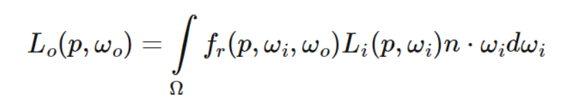
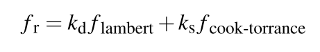
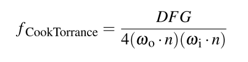
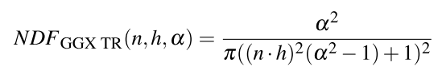
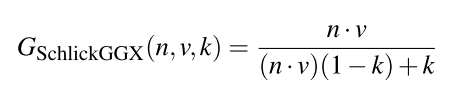
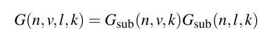
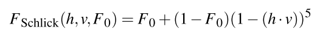
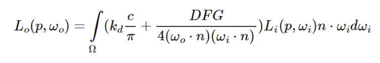

# Physical based rendering
물리적인 방식을 근사하여 빛을 모사하는 렌더링
PBR의 구현에는 크게 세 가지 요소가 존재한다.

- Microfacet Model
- 에너지 보존 법칙
- BRDF

이러한 요소들을 고려하여 렌더링한 이미지는 Phong, Blinn 모델에 비해 사실적으로 표현이 가능하고,
물리적인 파라미터를 가지고 재질 디자인이 가능하다는 장점이 있음.

매우 리얼한 렌더링 결과를 실시간에 얻어내는게 큰 장점.
대부분의 게임 엔진에 구현되어있는 기능이다.

한 주 만에 공부하기는 무리인 내용이지만, 어떤 개념이 있는지에 대해 들어보고 친숙해지는 시간을 가져보자.

## Microfacet Model
미세면 모델. 모든 물체의 면은 미세면이라느 불리우는 매우 작은 완전 반사 거울면으로 이루어져있다는 이론.
아주 작은 면들이 매우 작은 완전 반사 거울면이라, 빛을 반사하고 거친 면의 경우 면의 모양새가 불규칙. 빛이 동일하게 들어와도 반사되는 경로가 제각각.
-> 반사광이 분산되어 넓은 하이라이트가 생성
부드러운 면이면 반사광이 균일하여 작은 하이라이트 생성.

PBR의 기본적인 재질 디자인 -> microfacet model. 재질의 거칠기를 파라미터로 사용.

미세면은 매우 작아서 픽셀 레벨에서 구분이 불가하다고 생각하여, `roughness` 라는 파라미터로 면의 거친 정도를 통계적으로 근사함.
->  halfway 벡터가 얼마나 거칠기에 따라서 어떻게 분포하는가에 따라 `roughness` 를 나타냄.

## Energy conservation
출력되는 빛의 에너지가 입력되는 빛의 에너지보다 클 수 없다는 내용.
전체적인 에너지 합계는 유지되어야한다.

입사광이 물체에 닿으면 굴절광과 반사광으로 나뉘어 에너지 보존을 성립시킨다.

앞서 보았던 물체의 표면에 부딪혀 난반사가 일어난다는 것은 유전체(부도체)의 특징.
금속의 경우, 굴절광이 모두 흡수되어 분산광 색상이 사라짐.

앞서 미세면 모델에서는 roughness 였다면, 에너지 보존 법칙에서는 재질 디자인에서 사용할 수 있는 파라미터는 금속의 정도(metallic)이 된다.

에너지 보존 법칙을 고려한 반사/굴절 관계식.

```c
// reflection/specular fraction
flast kS = calculateSpecularComponent(...);
// refraction/diffuse fraction
float kD = 1.0 - kS;
```

### Reflectance equation
rendering equation의 특수한 형태


이 식을 뜯어보면서 PBR이 어떻게 디자인되어있는지를 알아볼 것이다.

- radiant flux: light source 로부터 전송된 에너지. (Watts 단위)
파장 길이에 대한 에너지 함수를 적분한 값.
RGB값으로 단순화하여 사용.

- Solid angle w: 단위 구에 투영한 면적과 각도를 가진 쉐입
- Radiant intensity I: 단위 구체 상의 면접 당 광원의 세기.
- Radiance L: 광원으로부터 에너지가 특정 각도로 입사했을 때 단위 면적 당 방출된 전자기파의 양.

- Reflected Radiance Lo: 특정 위치에서 출사 방향 벡터로 나오는 빛의 에너지 크기.
반구로 들어오는 모든 영역에서 입사 방향벡터에 대한 빛 에너지의 가중치 합.

적분에 대한 계산을 컴퓨터과학에서는 그냥 for문을 통해 합하는 과정을 가짐.

## BRDF - Bidirectional Reflective Distribution Function
양방향 반사도 분포 함수
입력: 입사각, 출사각, 법선벡터, roughness
특정 입사각으로 들어오는 광선이 반사광에 얼마나 기여하는가에 대한 분포 함수.
거울의 BRDF 함수: Wo와 Wi 가 서로 반사벡터 관계일 때만 1, 그 외에는 0.

우리가 다룰 BRDF는 "Cook-Torrance BRDF"
대부분의 실시간 PBR 렌더 파이프라인이 사용하는 BRDF
diffuse/specular term으로 나뉘어있음.


이 식은 두 가지 텀(반사/굴절)로 이루어지는데,
Refraction (diffuse) term: `c / pi`(c: albedo (surface color))

Reflection (specular) term
D: normal distribution function
G: geometry function
F: Fresnel equation
다양한 approximation function이 있음


### D: Trowbridge-Reitz GGX
미세먼이 하프웨이 벡터에 얼마나 정렬되어 있는지를 나타내는 분포함수

- n : normal vector
- h : halfway vector
- alpha : roughtness

D의 값에 따라 specular 형태가 달라지게 된다.

### G: Schlick-GGX
미세면의 거친 정도에 따라 발생하는 self-shadow 의 정도
빛의 방향/시선의 방향과도 연관이 있음.  

- n : normal vector
- v : view
- k : 
	Direct light { (alpha + 1)^2 / 8 }
	Image-based light { alpha^2 / 2 }

여기에 라이트의 방향을 고려하여,


빛의 방향 및 시선 방향 모두를 고려한 geometry function.

### F: Fresnel equation
시점이 주어졌을 때 표면에서 반사된 빛과 굴절된 빛 간의 비율
모든 면은 수직하게 관측하면 빛을 모두 반사시킨다.

F0: 면의 기본 반사율
재질에 따라 계산된 측정값을 참고한다.

단 비금속의 경우 평균적인 F0값인 0.04와 linear interpolation한 값을 공식에 적용.

## 최종 방정식

Cook-Torrance BRDF가 적용된 방정식.
Fresnel 값이 ks를 포함하고 있어서 식에서 제외.

## Material 구성 성분
Albedo: 면의 기본색상 (금속인 경우 F0)
Normal: 법선 방향(노말맵)
Metallic: 금속성 / 비금속성
Roughness: 면의 거칠기
AO: Ambient Occlusion

## Lighting 
점 광원에 대한 radiance 계산은 Phong의 diffuse 계산과 매우 유사하다
광원이 여러개 있는 경우, 모든 radiance의 합산으로 계산한다.

